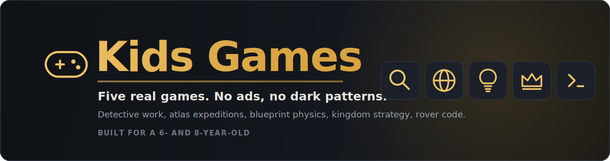

<div align="center">

  

  <h3>Five real games. No ads, no dark patterns, no talking mascots.</h3>

  <p><em>Educational web games for a 6- and 8-year-old, built to replace ad-funded iPad games. Real-tool register, learning through play, autosave, and read-aloud on every line of prose.</em></p>

  <p>
    <a href="https://cacardinal.github.io/kids-games-portfolio/"></a>
    
    
    
    
  </p>

</div>

---

# Kids Games Portfolio

Five educational web games for our 6-year-old and our 8-year-old, built to replace ad-funded iPad games. Real-tool register, no ads, no dark patterns, no streaks. All five shipped 2026-06-12 after a studio pipeline: spec, designer GDD, director approval, engineer build, QA, blind critic, fix rounds, re-verdict.

## Play online

Launcher: **https://cacardinal.github.io/kids-games-portfolio/**

- Detective Academy — https://cacardinal.github.io/kids-games-portfolio/detective-academy/
- World Explorer — https://cacardinal.github.io/kids-games-portfolio/world-explorer/
- Inventor Lab — https://cacardinal.github.io/kids-games-portfolio/inventor-lab/
- Strategy Kingdom — https://cacardinal.github.io/kids-games-portfolio/strategy-kingdom/
- Code Quest — https://cacardinal.github.io/kids-games-portfolio/code-quest/

Served from the `gh-pages` branch (a build artifact). The public build uses the default Player One / Player Two / Guest profiles — real first names live only in each app's gitignored `src/profiles.local.ts` and are quarantined out of the deploy.

**Redeploy:** `bash scripts/deploy-pages.sh --publish` (run `bash scripts/deploy-pages.sh` with no flag first for a build + privacy-guard dry run).

## The apps

| App | Port | Play it | Final verdict |
|-----|------|---------|---------------|
| Detective Academy | 5183 | solve warm little mysteries by citing evidence | SHIP — 361 tests |
| World Explorer | 5184 | passport-stamp atlas expeditions | SHIP — 44 tests |
| Inventor Lab | 5185 | blueprint physics contraptions, failure-is-data | SHIP — 120 tests |
| Strategy Kingdom | 5186 | visible-arithmetic kingdom seasons | SHIP — 76 tests |
| Code Quest | 5187 | mission-control rover programming | SHIP — 209 tests |

## Run

```bash
cd <app-dir> && npm install && npm run dev   # ports are pinned (strictPort)
```

Each app: `npx vitest run` (logic proofs), `npx tsc --noEmit`, `npm run build`. Profiles: Player One / Player Two / Guest (localStorage, per-profile saves, TTS read-aloud on all prose, mute persists). To use real first names locally without committing them, copy `src/profiles.local.example.ts` to `src/profiles.local.ts` (gitignored) in any app — its exported `PROFILES` replaces the defaults; the profile `id` keys each save.

## Where things are

- `PLAN.md` — architecture, studio model, engine decision, definition of done
- `specs/` — binding contracts; `specs/gdd/` — approved game design documents
- `verification/` — run-log, QA screenshots, full blind-critic reviews + re-verdicts per app
- `inventor-lab/TUNING.md` — matter-js findings (static-restitution bug, liveliness retune, snap-tolerance)

## Known follow-ups (v1.1 backlog)

Standing serve for the kids (LAN/LaunchAgent or built+hosted) · iPad manual smoke (speech, touch, add-to-home-screen) · Explorer: stamp-gating behind correct retry, landmark art, more regions · Detective: stable pets per character, deeper tier-3 reasoning · Code Quest: sector 4+, broader read-aloud · Kingdom: deeper event decks, endless mode · Inventor: sandbox mode, seesaw part · All: offline service workers.
